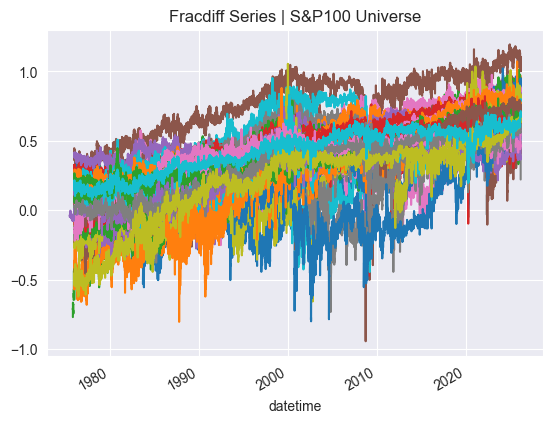
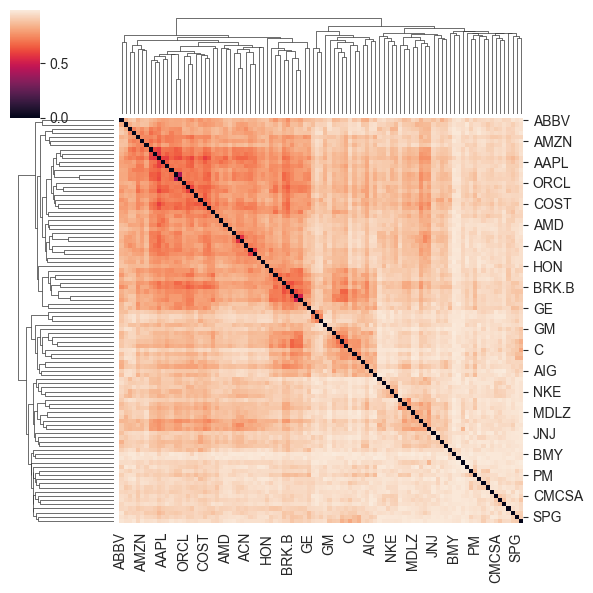
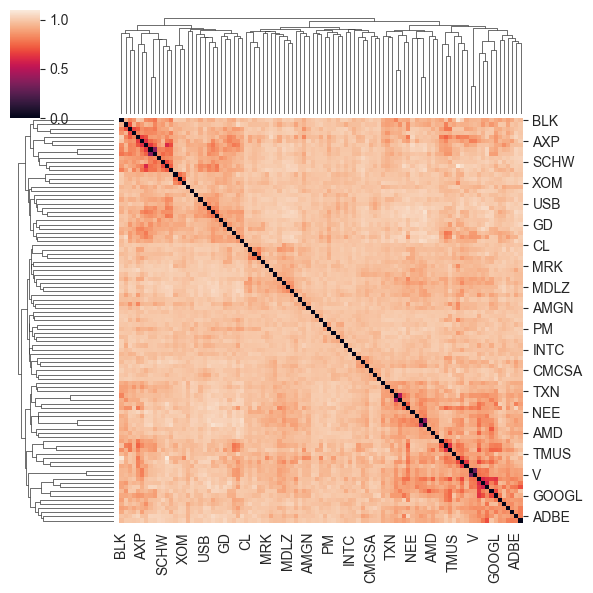
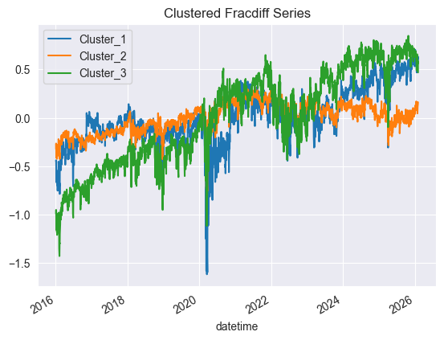

## Causal-Inference Based Portfolio Optimization (CIBPO)

> **"Correlation is not causation—especially when your portfolio depends on it."**

### 🚀 Research Overview
Traditional portfolio optimization (e.g., Markowitz, Black-Litterman) relies heavily on **Pearson correlation matrices**, which notoriously collapse during market crises and offer zero explainability. This project introduces a structural paradigm shift in asset allocation by integrating **Information Theory** and **Differentiable Causal Discovery**.

Inspired by the work of **Marcos López de Prado**, this framework moves beyond "what moves together" to "what causes what." By extracting a **Directed Acyclic Graph (DAG)** from 100 assets, we identify the underlying structural drivers of the market.

### 🧠 Why This Matters
Financial markets are not just sets of numbers; they are complex, adaptive systems with a hidden hierarchy. 
* **Beyond Linearity**: We use **Mutual Information (MI)** to capture non-linear dependencies that standard correlation misses.
* **Scale & Precision**: We compress massive asset universes into "Latent Causal Nodes" via cluster-based PCA, making high-dimensional causal inference computationally feasible.
* **Strategic Intervention**: Using **Pearl's Do-calculus**, portfolio managers can inject subjective views ("What if Energy prices spike?") and simulate the structural propagation of shocks across the entire portfolio.

### 🧬 The "Causal-HRP" Pipeline
1. **Denoise**: Filter spurious signals using Random Matrix Theory (RMT).
2. **Cluster**: Group assets via Variation of Information (VI) to find "Information Teams."
3. **Compress**: Extract the first principal component ($PC_1$) to represent each cluster node.
4. **Discover**: Map the market's "DNA" using **NOTEARS** to generate a Directed Acyclic Graph (DAG).
5. **Intervene**: Apply **Do-calculus** to tilt weights based on causal impact, not just price momentum.

### Research Procedure: Causal-Inference Based Portfolio Optimization

#### Phase 1: Adaptive Data Preprocessing & Memory Preservation
To extract genuine causal signals while preserving the predictive power of financial time series, we implement a memory-preserving stationarity transformation.

* **Global Fractional Differentiation**: To overcome the stationarity-memory trade-off of integer differencing, we apply fractional differentiation. For cross-sectional consistency across the 1,000+ asset universe, we compute the optimal $d$ for each asset and apply the **95th percentile value** globally:

$$\Delta^d P_t = \sum_{k=0}^{\infty} \binom{d}{k} (-1)^k P_{t-k}$$

#### Phase 2: Information-Theoretic Topology & Robustness
Traditional Pearson correlation often misses non-linear dependencies and assumes Gaussian distributions. We utilize Information Theory to map the non-linear topology of the market.

* **Normalized Variation of Information (NVI)**: We compute a true metric distance based on Mutual Information $I(X; Y)$. Unlike correlation, VI is invariant to monotonic transformations and captures complex non-linear associations:

$$d(X, Y) = 1 - \frac{I(X; Y)}{H(X, Y)}$$

  
* **Distance Matrix Regularization (Denoising)**: Since the NVI matrix does not follow the Wishart distribution required for standard Marchenko-Pastur denoising, we apply **Graph-based Regularization** (e.g., Thresholding or Shrinkage). This filters out spurious information and ensures the matrix is Positive Semi-Definite (PSD) while preserving the metric properties (triangle inequality) of the distance measure.

* **Manifold Detoning**: To prevent the "Market Tone" (the dominant first principal component) from obscuring the underlying causal clusters, we perform detoning on the similarity space ($S = 1 - d_{reg}$). This ensures that the subsequent allocation focuses on idiosyncratic cluster dynamics rather than beta-driven noise.

* **HCAA (Hierarchical Cluster Asset Allocation)**: Using the denoised and detoned similarity weights, assets are grouped into $K$ hierarchical clusters (typically $K \in [20, 50]$). This creates a recursive tree structure that serves as the backbone for the Causal Allocation, ensuring that capital is distributed across statistically independent risk factors rather than just individual tickers.

#### Phase 3: Node Aggregation via Cluster-PCA
To reduce the dimensionality for the DAG search, we condense each cluster into a single "Latent Causal Node."

* **Cluster Representation**: For each cluster $C_k$, extract the subset of returns $R_{C_k}$.
* **First Principal Component ($PC_1$)**: Extract the dominant signal that explains the maximum variance within the cluster:

$$Z_k = \mathbf{w}_1^T R_{C_k}$$

$Z_k$ now serves as the representative time-series for the $k$-th causal node.

#### Phase 4: Causal Discovery (DAG Construction)
We identify the directional flow of information between the aggregated cluster nodes.

* **NOTEARS (Non-combinatorial Optimization)**: Learn the adjacency matrix $W$ by solving:

$$\min_{W} \frac{1}{2n} \|Z - ZW\|^2_F + \rho \|W\|_1 \quad \text{s.t. } \text{tr}(e^{W \circ W}) - K = 0$$

* **Dynamic Extension**: Incorporate time-lagged effects to capture lead-lag relationships:

$$Z_t = W_0^T Z_t + \sum_{\tau=1}^p W_\tau^T Z_{t-\tau} + \epsilon_t$$

#### Phase 5: Automated Causal Validation & Edge Pruning
To handle the high-dimensional complexity of 1,000+ assets, we implement an automated validation pipeline that filters out spurious causal links using rigorous statistical tests.

* **Automated Double Machine Learning (DML)**: For every edge $i \to j$ identified in the DAG, the system automatically executes a DML regressor. By treating all other relevant nodes as potential confounders $X$, it computes a debiased causal effect $\hat{\theta}_{i \to j}$:
    1.  **Nuisance Parameter Estimation**: $E[Z_j | X]$ and $E[Z_i | X]$ are estimated via Cross-Validation.
    2.  **Edge Pruning**: Any edge where the $p\text{-value}$ of $\hat{\theta}$ exceeds the significance threshold (e.g., $\alpha = 0.05$) is automatically pruned from the graph.

* **Refutation & Sensitivity Testing**: The pipeline conducts automated "What-if" stress tests on the discovered DAG:
    * **Placebo Test**: Replacing the treatment node with random noise to ensure the causal effect drops to zero.
    * **Data Subsampling**: Checking the stability of edges across different time regimes to ensure the relationship is not a temporal artifact.

* **Mediator-Confounder Separation**: The system automatically classifies nodes into **Mediators** or **Confounders** for any given pair, ensuring that the Do-calculus in Phase 6 does not suffer from "Bad Control" bias.

#### Phase 6: Causal Intervention (Do-calculus)
This step allows the manager to inject subjective views into the objective causal structure.

* **Structural Intervention**: Apply the do-operator to node $j$ with value $v$: $do(Z_j = v)$.
* **Total Causal Effect**: Calculate the propagation of the shock using the transfer matrix $T$:

$$T = (I - W_0^T)^{-1}$$
$$\tilde{\mu}_{causal} = T \cdot \mathbf{v}_{view}$$

* **Path Analysis**: Quantify how the intervention at the source node affects downstream assets over the investment horizon $H$.

#### Phase 7: Optimization via Causal-HRP
The final weights are calculated by merging the HRP risk-distribution with the causal-tilting logic.

* **Recursive Bisection**: Split the cluster tree into left ($L$) and right ($R$) branches.
* **Causal Weight Tilting**: Adjust the allocation factor $\alpha$ based on the causal expected returns $\tilde{\mu}$:

$$\alpha^* = \alpha_{IVP} \times \left( 1 + \lambda \frac{\tilde{\mu}_L - \tilde{\mu}_R}{|\tilde{\mu}_L| + |\tilde{\mu}_R|} \right)$$

* **Final Allocation**: The weight for asset $i$ is the product of all adjusted factors along its path:

$$w_i = \prod_{n \in \text{path}(i)} \alpha_n^*$$

### 🏷️ Keywords
`Causal Inference` · `Directed Acyclic Graphs (DAG)` · `Hierarchical Risk Parity (HRP)` · `Information Theory` · `Mutual Information` · `Machine Learning for Finance` · `Structural Causal Models (SCM)` · `Portfolio Optimization` · `NOTEARS Algorithm` · `Denoising` · `Marchenko-Pastur Law`

---

### 📚 Selected References

* **López de Prado, M.** (2018). *Advances in Financial Machine Learning*. John Wiley & Sons.
* **López de Prado, M.** (2020). *Machine Learning for Asset Managers*. Cambridge University Press.
* **López de Prado, M.** (2016). "Building Differential Portfolios". *Journal of Risk*.
* **Zheng, X., Aragam, B., Ravikumar, P. K., & Xing, E. P.** (2018). "DAGs with NO TEARS: Continuous Optimization for Structure Learning". *Advances in Neural Information Processing Systems (NeurIPS)*.
* **Pearl, J.** (2009). *Causality: Models, Reasoning, and Inference*. Cambridge University Press.
* **Peters, J., Janzing, D., & Schölkopf, B.** (2017). *Elements of Causal Inference: Foundations and Learning Algorithms*. MIT Press.
* **Spirtes, P., Glymour, C. N., & Scheines, R.** (2000). *Causation, Prediction, and Search*. MIT Press.
* **Kraskov, A., Stögbauer, H., & Grassberger, P.** (2004). "Estimating Mutual Information". *Physical Review E*.
* **Marti, G., Andler, S., Nielsen, F., & Donnat, P.** (2016). "Clustering Financial Time Series: New Insights from an Extended Survey". *arXiv preprint*.
* **Laloux, L., Cizeau, P., Potters, M., & Bouchaud, J. P.** (2000). "Random Matrix Theory in Financial Analysis". *International Journal of Theoretical and Applied Finance*.