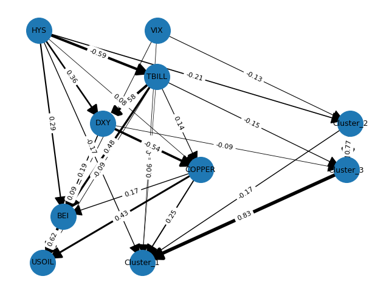
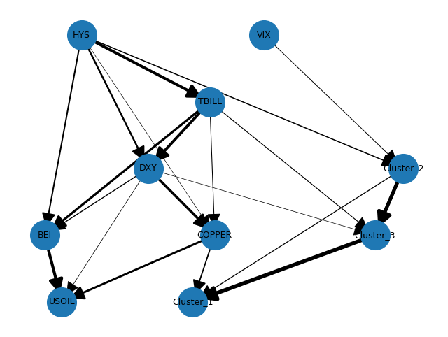
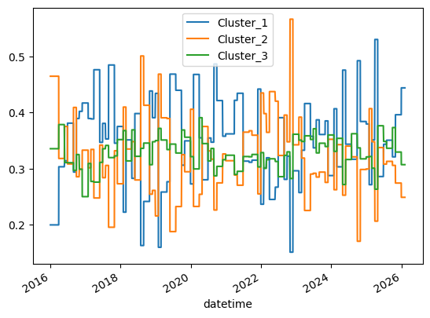

## Causal-Inference Based Portfolio Optimization (CIBPO)

> **"Correlation is not causation—especially when your portfolio depends on it."**

### 🚀 Research Overview
Traditional portfolio optimization (e.g., Markowitz, Black-Litterman) relies heavily on **Pearson correlation matrices**, which notoriously collapse during market crises and offer zero explainability. This project introduces a structural paradigm shift in asset allocation by integrating **Information Theory** and **Differentiable Causal Discovery**.

Inspired by the work of **Marcos López de Prado**, this framework moves beyond "what moves together" to "what causes what." By extracting a **Directed Acyclic Graph (DAG)** from 100 assets, we identify the underlying structural drivers of the market.

### 🧠 Why This Matters
Financial markets are not just sets of numbers; they are complex, adaptive systems with a hidden hierarchy. 
* **Beyond Linearity**: We use **Mutual Information (MI)** to capture non-linear dependencies that standard correlation misses.
* **Scale & Precision**: We compress massive asset universes into "Latent Causal Nodes" via cluster-based PCA, making high-dimensional causal inference computationally feasible.
* **Strategic Intervention**: Using **Pearl's Do-calculus**, portfolio managers can inject subjective views ("What if Energy prices spike?") and simulate the structural propagation of shocks across the entire portfolio.

### 🧬 The "Causal-HRP" Pipeline
1. **Denoise**: Filter spurious signals using Random Matrix Theory (RMT).
2. **Cluster**: Group assets via Variation of Information (VI) to find "Information Teams."
3. **Compress**: Extract the first principal component ($PC_1$) to represent each cluster node.
4. **Discover**: Map the market's "DNA" using **NOTEARS** to generate a Directed Acyclic Graph (DAG).
5. **Intervene**: Apply **Do-calculus** to tilt weights based on causal impact, not just price momentum.

### Research Procedure: Causal-Inference Based Portfolio Optimization

#### Phase 1: Adaptive Data Preprocessing & Memory Preservation
To extract genuine causal signals while preserving the predictive power of financial time series, we implement a memory-preserving stationarity transformation.

* **Global Fractional Differentiation**: To overcome the stationarity-memory trade-off of integer differencing, we apply fractional differentiation. For cross-sectional consistency across the 1,000+ asset universe, we compute the optimal $d$ for each asset and apply the **95th percentile value** globally:

$$\Delta^d P_t = \sum_{k=0}^{\infty} \binom{d}{k} (-1)^k P_{t-k}$$

#### Phase 2: Information-Theoretic Topology & Robustness
Traditional Pearson correlation often misses non-linear dependencies and assumes Gaussian distributions. We utilize Information Theory to map the non-linear topology of the market.

* **Normalized Variation of Information (NVI)**: We compute a true metric distance based on Mutual Information $I(X; Y)$. Unlike correlation, VI is invariant to monotonic transformations and captures complex non-linear associations:

$$d(X, Y) = 1 - \frac{I(X; Y)}{H(X, Y)}$$

  
* **Distance Matrix Regularization (Denoising)**: Since the NVI matrix does not follow the Wishart distribution required for standard Marchenko-Pastur denoising, we apply **Graph-based Regularization** (e.g., Thresholding or Shrinkage). This filters out spurious information and ensures the matrix is Positive Semi-Definite (PSD) while preserving the metric properties (triangle inequality) of the distance measure.

* **Manifold Detoning**: To prevent the "Market Tone" (the dominant first principal component) from obscuring the underlying causal clusters, we perform detoning on the similarity space ($S = 1 - d_{reg}$). This ensures that the subsequent allocation focuses on idiosyncratic cluster dynamics rather than beta-driven noise.

* **HCAA (Hierarchical Cluster Asset Allocation)**: Using the denoised and detoned similarity weights, assets are grouped into $K$ hierarchical clusters (typically $K \in [20, 50]$). This creates a recursive tree structure that serves as the backbone for the Causal Allocation, ensuring that capital is distributed across statistically independent risk factors rather than just individual tickers.

#### Phase 3: Node Aggregation via Cluster-PCA
To reduce the dimensionality for the DAG search, we condense each cluster into a single "Latent Causal Node."

* **Cluster Representation**: For each cluster $C_k$, extract the subset of returns $R_{C_k}$.
* **First Principal Component ($PC_1$)**: Extract the dominant signal that explains the maximum variance within the cluster:

$$Z_k = \mathbf{w}_1^T R_{C_k}$$

$Z_k$ now serves as the representative time-series for the $k$-th causal node.

#### Phase 4: Causal Discovery (Static DAG Construction with Structural Priors)

We identify the directional flow of information between macro factors and cluster-level latent return components.

* **DirectLiNGAM with Structural Priors**:  
We estimate a static causal graph under non-Gaussian noise and linear SEM assumptions:

$$
Z = B^T Z + \epsilon, \quad \epsilon \perp Z
$$

where $B$ is a weighted adjacency matrix such that $B_{ij} \neq 0$ implies $j \rightarrow i$.

Structural priors are imposed to enforce economically consistent constraints:
- No Cluster → Macro edges (macro factors are exogenous drivers)
- Directional constraints on TBILL (e.g., others → TBILL forbidden to enforce TBILL as a policy-driven source variable)
- Optional soft constraints among macro factors to prevent implausible feedback loops

These priors are implemented via a prior-knowledge mask, which prunes the admissible edge space before LiNGAM estimation.

* **Post-estimation Structural Regularization**:  
To mitigate over-dense graphs induced by statistical noise, we apply top-k in-edge pruning:

$$
\mathcal{P}_k(j) = \text{Top-}k \{ |B_{ij}| : i \in \text{Parents}(j) \}
$$

Edges outside $\mathcal{P}_k(j)$ are removed to enforce economic sparsity and interpretability.

#### Phase 5: Automated Causal Validation & Edge Pruning (DML-based Refinement)

To eliminate spurious causal links implied by LiNGAM, we construct an automated validation pipeline using Double Machine Learning (DML).

For every directed edge $i \rightarrow j$ in the estimated DAG:

* **DML-based Effect Estimation**

$$
Z_j = \theta_{i \to j} Z_i + f(X) + \varepsilon
$$

where $X$ consists of automatically identified confounders only  
(colliders excluded; mediators optionally excluded for total effect estimation).

Nuisance functions are estimated via cross-fitted machine learning models.

* **Edge Pruning Rule**

$$
\text{Keep edge } i \rightarrow j 
\quad \text{iff} \quad 
p(\hat{\theta}_{i \to j}) \le \alpha
$$

Edges failing statistical significance are removed from the causal graph.

* **Stability Diagnostics (Lightweight)**  
The pipeline performs:
- rolling-window re-estimation stability checks  
- pruning sensitivity tests under different sparsity thresholds  

This guards against regime-specific or transient spurious causality.

#### Phase 6: Causal Intervention (Do-calculus on Structural Graph)

This step integrates analyst views into the objective causal structure via structural interventions.

* **Structural Intervention**

$$
do(Z_j = v)
$$

* **Linear Propagation of Shocks**

$$
Z = (I - B^T)^{-1} \epsilon
$$

$$
T = (I - B^T)^{-1}
$$

$$
\tilde{\mu}_{\text{causal}} = T \cdot \mathbf{v}_{\text{view}}
$$

This yields cluster-level and asset-level causal return tilts implied by the analyst’s macro scenario.

* **Path Decomposition (Optional Diagnostics)**  
We optionally decompose the propagation into dominant causal paths to interpret which macro-to-cluster channels transmit the shock.

#### Phase 7: Portfolio Optimization via Causal-HRP / Causal-NCO Hybrid

The final allocation integrates:

1. **Risk Allocation Backbone (HRP / NCO)**  
Baseline cluster and asset-level risk allocation using HRP or NCO.

2. **Causal Tilting Layer**

$$
\tilde{\mu}_c = \sum_{j \in \text{Macro}} T_{cj} v_j
$$

$$
w_c^* \propto w_c^{\text{risk}} \cdot (1 + \lambda \cdot \tilde{\mu}_c)
$$

3. **Intra-cluster NCO Refinement**

Final asset weight:

$$
w_i = w_{c(i)}^* \cdot w_{i|c(i)}^{\text{NCO}}
$$

### 🏷️ Keywords
`Causal Inference` · `Directed Acyclic Graphs (DAG)` · `Hierarchical Risk Parity (HRP)` · `Information Theory` · `Mutual Information` · `Machine Learning for Finance` · `Structural Causal Models (SCM)` · `Portfolio Optimization` · `NOTEARS Algorithm` · `Denoising` · `Marchenko-Pastur Law`

---

### 📚 Selected References

* **López de Prado, M.** (2018). *Advances in Financial Machine Learning*. John Wiley & Sons.
* **López de Prado, M.** (2020). *Machine Learning for Asset Managers*. Cambridge University Press.
* **López de Prado, M.** (2016). "Building Differential Portfolios". *Journal of Risk*.
* **Zheng, X., Aragam, B., Ravikumar, P. K., & Xing, E. P.** (2018). "DAGs with NO TEARS: Continuous Optimization for Structure Learning". *Advances in Neural Information Processing Systems (NeurIPS)*.
* **Pearl, J.** (2009). *Causality: Models, Reasoning, and Inference*. Cambridge University Press.
* **Peters, J., Janzing, D., & Schölkopf, B.** (2017). *Elements of Causal Inference: Foundations and Learning Algorithms*. MIT Press.
* **Spirtes, P., Glymour, C. N., & Scheines, R.** (2000). *Causation, Prediction, and Search*. MIT Press.
* **Kraskov, A., Stögbauer, H., & Grassberger, P.** (2004). "Estimating Mutual Information". *Physical Review E*.
* **Marti, G., Andler, S., Nielsen, F., & Donnat, P.** (2016). "Clustering Financial Time Series: New Insights from an Extended Survey". *arXiv preprint*.
* **Laloux, L., Cizeau, P., Potters, M., & Bouchaud, J. P.** (2000). "Random Matrix Theory in Financial Analysis". *International Journal of Theoretical and Applied Finance*.