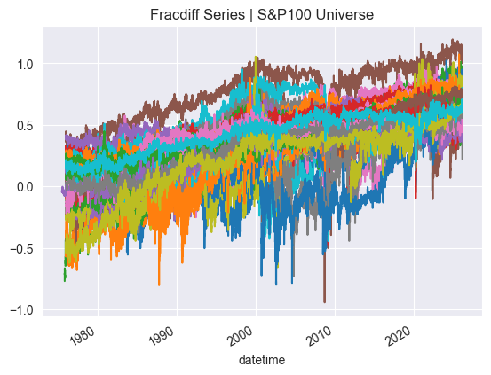
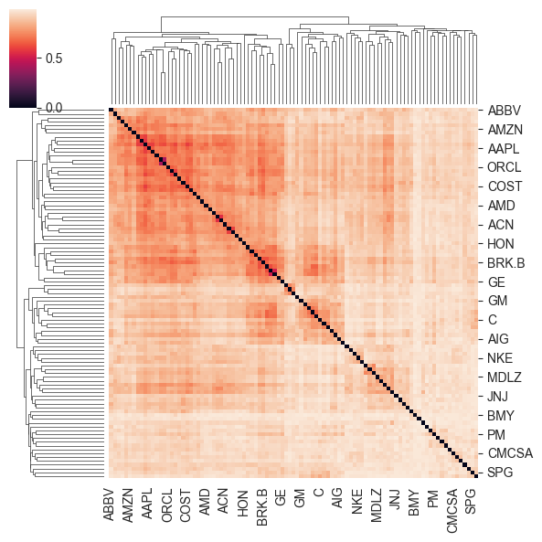
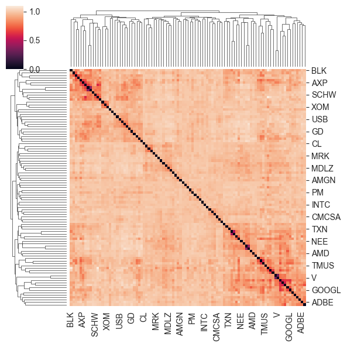
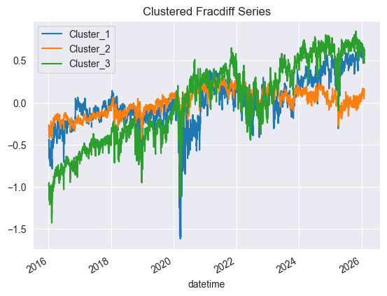
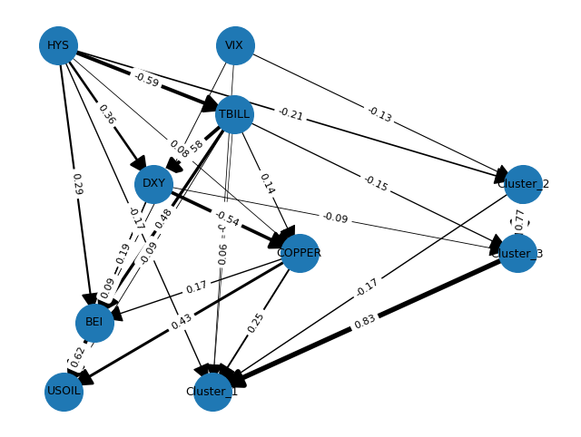
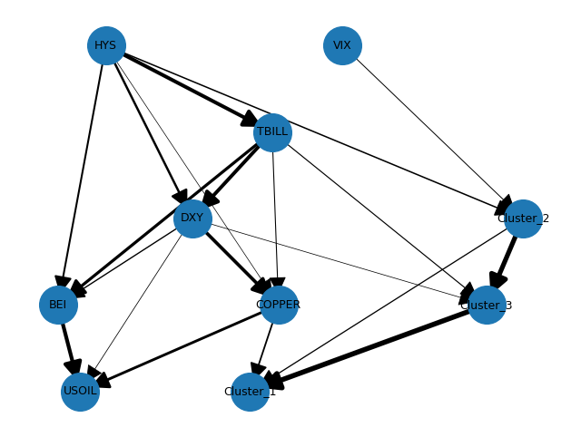
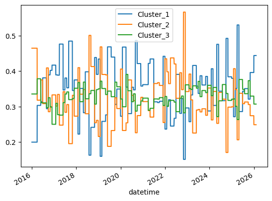

## Causal-Inference Based Portfolio Optimization (CIBPO)

> **"Correlation is not causation—especially when your portfolio depends on it."**

### 🚀 Research Overview
Traditional portfolio optimization (e.g., Markowitz, Black-Litterman) relies heavily on **Pearson correlation matrices**, which notoriously collapse during market crises and offer zero explainability. This project introduces a structural paradigm shift in asset allocation by integrating **Information Theory** and **Differentiable Causal Discovery**.

Inspired by the work of **Marcos López de Prado**, this framework moves beyond "what moves together" to "what causes what." By extracting a **Directed Acyclic Graph (DAG)** from 100 assets, we identify the underlying structural drivers of the market.

### 🧠 Why This Matters
Financial markets are not just sets of numbers; they are complex, adaptive systems with a hidden hierarchy. 
* **Beyond Linearity**: We use **Mutual Information (MI)** to capture non-linear dependencies that standard correlation misses.
* **Scale & Precision**: We compress massive asset universes into "Latent Causal Nodes" via cluster-based PCA, making high-dimensional causal inference computationally feasible.
* **Strategic Intervention**: Using **Pearl's Do-calculus**, portfolio managers can inject subjective views ("What if Energy prices spike?") and simulate the structural propagation of shocks across the entire portfolio.

### 🧬 The "Causal-HRP" Pipeline
1. **Denoise**: Filter spurious signals using Random Matrix Theory (RMT).
2. **Cluster**: Group assets via Variation of Information (VI) to find "Information Teams."
3. **Compress**: Extract the first principal component ($PC_1$) to represent each cluster node.
4. **Discover**: Map the market's "DNA" using **NOTEARS** to generate a Directed Acyclic Graph (DAG).
5. **Intervene**: Apply **Do-calculus** to tilt weights based on causal impact, not just price momentum.

### Research Procedure: Causal-Inference Based Portfolio Optimization

#### Phase 1: Adaptive Data Preprocessing & Memory Preservation
To extract genuine causal signals while preserving the predictive power of financial time series, we implement a memory-preserving stationarity transformation.

* **Global Fractional Differentiation**: To overcome the stationarity-memory trade-off of integer differencing, we apply fractional differentiation. For cross-sectional consistency across the 1,000+ asset universe, we compute the optimal $d$ for each asset and apply the **95th percentile value** globally:

$$\Delta^d P_t = \sum_{k=0}^{\infty} \binom{d}{k} (-1)^k P_{t-k}$$

#### Phase 2: Information-Theoretic Topology & Robustness (Denoising & Detoning without MP)

Traditional Pearson correlation assumes linear dependence and Gaussianity, which are violated in financial time series with regime shifts, tail dependence, and non-linear co-movements. We therefore construct the market topology using Information-Theoretic distances.

* **Normalized Variation of Information (NVI)**  
We compute a metric distance based on Mutual Information $I(X; Y)$:

$$
d(X, Y) = 1 - \frac{I(X; Y)}{H(X, Y)}
$$

This distance:
- captures non-linear dependencies,
- is invariant to monotonic transformations,
- satisfies the triangle inequality,
- and provides a geometry on the space of asset return distributions.

* **Graph-based Regularization (Denoising without Marchenko–Pastur)**  
Since the NVI distance matrix does not follow the Wishart eigenvalue distribution required for standard Random Matrix Theory (Marchenko–Pastur) denoising, we apply a topology-preserving regularization:

- **k-Nearest Neighbor (k-NN) filtering / thresholding** to remove weak, noise-driven links  
- **Graph Laplacian smoothing or shrinkage** to enforce positive semi-definiteness  
- **Spectral clipping** on the similarity matrix $S = 1 - d(X,Y)$  

This procedure suppresses spurious dependencies while preserving:
- metric consistency,
- topological neighborhood relations,
- and cluster separability.

* **Manifold Detoning (Market Mode Removal in Similarity Space)**  
To prevent the dominant "market mode" (first principal component) from collapsing the geometry into a single beta-driven factor, we perform detoning directly on the similarity manifold:

$$
S = 1 - d_{\text{reg}}(X,Y)
$$

We remove the first eigencomponent of $S$ and renormalize the residual similarity matrix.  
This ensures that subsequent clustering and causal discovery focus on **idiosyncratic inter-cluster dynamics** rather than global risk-on / risk-off effects.

#### Phase 3: Node Aggregation via Cluster-PCA
To reduce the dimensionality for the DAG search, we condense each cluster into a single "Latent Causal Node."

* **Cluster Representation**: For each cluster $C_k$, extract the subset of returns $R_{C_k}$.
* **First Principal Component ($PC_1$)**: Extract the dominant signal that explains the maximum variance within the cluster:

$$Z_k = \mathbf{w}_1^T R_{C_k}$$

$Z_k$ now serves as the representative time-series for the $k$-th causal node.

#### Phase 4: Causal Discovery (Static DAG Construction with Structural Priors)

We identify the directional flow of information between macro factors and cluster-level latent return components.

* **DirectLiNGAM with Structural Priors**:  
We estimate a static causal graph under non-Gaussian noise and linear SEM assumptions:

$$
Z = B^T Z + \epsilon, \quad \epsilon \perp Z
$$

where $B$ is a weighted adjacency matrix such that $B_{ij} \neq 0$ implies $j \rightarrow i$.

Structural priors are imposed to enforce economically consistent constraints:
- No Cluster → Macro edges (macro factors are exogenous drivers)
- Directional constraints on TBILL (e.g., others → TBILL forbidden to enforce TBILL as a policy-driven source variable)
- Optional soft constraints among macro factors to prevent implausible feedback loops

These priors are implemented via a prior-knowledge mask, which prunes the admissible edge space before LiNGAM estimation.

* **Post-estimation Structural Regularization**:  
To mitigate over-dense graphs induced by statistical noise, we apply top-k in-edge pruning:

$$
\mathcal{P}_k(j) = \text{Top-}k \{ |B_{ij}| : i \in \text{Parents}(j) \}
$$

Edges outside $\mathcal{P}_k(j)$ are removed to enforce economic sparsity and interpretability.

#### Phase 5: Automated Causal Validation & Edge Pruning (DML-based Refinement)

To eliminate spurious causal links implied by LiNGAM, we construct an automated validation pipeline using Double Machine Learning (DML).

For every directed edge $i \rightarrow j$ in the estimated DAG:

* **DML-based Effect Estimation**

$$
Z_j = \theta_{i \to j} Z_i + f(X) + \varepsilon
$$

where $X$ consists of automatically identified confounders only  
(colliders excluded; mediators optionally excluded for total effect estimation).

Nuisance functions are estimated via cross-fitted machine learning models.

* **Edge Pruning Rule**

$$
\text{Keep edge } i \rightarrow j 
\quad \text{iff} \quad 
p(\hat{\theta}_{i \to j}) \le \alpha
$$

Edges failing statistical significance are removed from the causal graph.

* **Stability Diagnostics (Lightweight)**  
The pipeline performs:
- rolling-window re-estimation stability checks  
- pruning sensitivity tests under different sparsity thresholds  

This guards against regime-specific or transient spurious causality.

#### Phase 6: LLM-based Macro Forecasting with RAG Filtering (Analyst View Generation)

Before performing causal intervention, we generate forward-looking macro views using an LLM and optionally filter them through a retrieval-augmented validation layer. This step operationalizes analyst-style subjective views in a systematic and reproducible manner.

* **Monthly Macro Forecast Generation (LLM)**  
At each month-end rebalancing date, we generate 1-month-ahead conditional forecasts for each macro node using an LLM:

$$
v_j(t+1) = \text{LLM}\Big( \text{MacroHistory}_j(1{:}t), \ \text{SPX}(1{:}t) \Big)
$$

Each forecast returns:
- A continuous numeric expectation $v_j(t+1)$  
- A confidence score $c_j(t+1) \in [0, 1]$  
- A short textual rationale (stored for auditability)

* **RAG-based View Validation (Optional Gatekeeper)**  
Generated views are optionally passed through a retrieval-augmented validation layer that checks consistency against:

- Recent macro releases  
- Market narratives (e.g., Fed guidance, inflation regime shifts)  
- Historical analog regimes  

The validation model outputs an acceptance probability:

$$
\pi_j(t+1) = \text{RAG}\Big(v_j(t+1), \ \mathcal{D}_{\text{macro}}(t)\Big)
$$

Views with low $\pi_j(t+1)$ can be:
- down-weighted,
- clipped, or
- discarded before causal intervention.

* **Confidence-weighted View Vector**

The final intervention vector is constructed as:

$$
\mathbf{v}_{\text{view}}(t+1)
= \Big( c_1 \pi_1 v_1, \; c_2 \pi_2 v_2, \; \dots, \; c_K \pi_K v_K \Big)^\top
$$

This produces a disciplined analyst-view vector that feeds into the causal intervention step.

---

#### Phase 7: Causal Intervention (Do-calculus on Structural Graph)

This step integrates analyst views into the objective causal structure via structural interventions.

* **Structural Intervention**

$$
do(Z_j = v)
$$

* **Linear Propagation of Shocks**

$$
Z = (I - B^T)^{-1} \epsilon
$$

$$
T = (I - B^T)^{-1}
$$

$$
\tilde{\mu}_{\text{causal}} = T \cdot \mathbf{v}_{\text{view}}
$$

This yields cluster-level and asset-level causal return tilts implied by the analyst’s macro scenario.

* **Path Decomposition (Optional Diagnostics)**  
We optionally decompose the propagation into dominant causal paths to interpret which macro-to-cluster channels transmit the shock.

#### Phase 8: Portfolio Optimization via Causal-HRP / Causal-NCO Hybrid

The final allocation integrates:

1. **Risk Allocation Backbone (HRP / NCO)**  
Baseline cluster and asset-level risk allocation using HRP or NCO.

2. **Causal Tilting Layer**

$$
\tilde{\mu}_c = \sum_{j \in \text{Macro}} T_{cj} v_j
$$

$$
w_c^* \propto w_c^{\text{risk}} \cdot (1 + \lambda \cdot \tilde{\mu}_c)
$$

3. **Intra-cluster NCO Refinement**

Final asset weight:

$$
w_i = w_{c(i)}^* \cdot w_{i|c(i)}^{\text{NCO}}
$$

### 🏷️ Keywords
`Causal Inference` · `Directed Acyclic Graphs (DAG)` · `Hierarchical Risk Parity (HRP)` · `Information Theory` · `Mutual Information` · `Machine Learning for Finance` · `Structural Causal Models (SCM)` · `Portfolio Optimization` · `NOTEARS Algorithm` · `Denoising` · `Marchenko-Pastur Law`

---

### 📚 References

* **López de Prado, M.** (2018). *Advances in Financial Machine Learning*. John Wiley & Sons.  
  — Event-based sampling, HRP/NCO, denoising, and structural portfolio construction backbone.

* **López de Prado, M.** (2020). *Machine Learning for Asset Managers*. Cambridge University Press.  
  — Hierarchical allocation, bet sizing, and production-oriented ML pipeline for portfolio construction.

* **López de Prado, M.** (2016). "Building Diversified Portfolios that Outperform Out of Sample". *Journal of Risk*.  
  — Hierarchical clustering-based allocation logic (HRP) used as the risk backbone of the causal allocation layer.

* **Zheng, X., Aragam, B., Ravikumar, P. K., & Xing, E. P.** (2018).  
  "DAGs with NO TEARS: Continuous Optimization for Structure Learning". *NeurIPS*.  
  — Continuous optimization framework for DAG discovery; conceptual foundation for causal graph learning.

* **Shimizu, S., Hoyer, P. O., Hyvärinen, A., & Kerminen, A.** (2006).  
  "A Linear Non-Gaussian Acyclic Model for Causal Discovery (LiNGAM)". *Journal of Machine Learning Research*.  
  — Core causal discovery model used for static DAG estimation in the proposed causal allocation pipeline.

* **Pearl, J.** (2009). *Causality: Models, Reasoning, and Inference*. Cambridge University Press.  
  — Do-calculus and structural intervention framework for translating analyst views into causal shocks.

* **Peters, J., Janzing, D., & Schölkopf, B.** (2017).  
  *Elements of Causal Inference: Foundations and Learning Algorithms*. MIT Press.  
  — Theoretical grounding for causal discovery, intervention, and invariance-based reasoning.

* **Spirtes, P., Glymour, C. N., & Scheines, R.** (2000).  
  *Causation, Prediction, and Search*. MIT Press.  
  — Constraint-based causal discovery foundations (PC, conditional independence testing) informing causal validation logic.

* **Chernozhukov, V., Chetverikov, D., Demirer, M., Duflo, E., Hansen, C., Newey, W., & Robins, J.** (2018).  
  "Double/Debiased Machine Learning for Treatment and Structural Parameters". *The Econometrics Journal*.  
  — Statistical foundation of the automated DML-based causal edge validation and pruning layer.

* **Kraskov, A., Stögbauer, H., & Grassberger, P.** (2004).  
  "Estimating Mutual Information". *Physical Review E*.  
  — Nonlinear dependence estimation used for exploratory screening and robustness diagnostics in factor relationships.

* **Marti, G., Andler, S., Nielsen, F., & Donnat, P.** (2016).  
  "Clustering Financial Time Series: New Insights from an Extended Survey". *arXiv preprint*.  
  — Time-series clustering and correlation-distance frameworks for cluster construction prior to causal modeling.

* **Laloux, L., Cizeau, P., Potters, M., & Bouchaud, J. P.** (2000).  
  "Random Matrix Theory in Financial Analysis". *International Journal of Theoretical and Applied Finance*.  
  — Eigenvalue denoising and covariance cleaning used for HRP/NCO stability and noise suppression.

* **Rasmussen, C. E., & Williams, C. K. I.** (2006).  
  *Gaussian Processes for Machine Learning*. MIT Press.  
  — Regime uncertainty modeling and robustness checks for macro-driven conditional forecasts.

* **Lewis, P., Perez, E., Piktus, A., et al.** (2020).  
  "Retrieval-Augmented Generation for Knowledge-Intensive NLP Tasks". *NeurIPS*.  
  — Conceptual foundation of the RAG-based macro view validation layer for filtering LLM-generated forecasts.

* **Bommasani, R., et al.** (2021).  
  "On the Opportunities and Risks of Foundation Models". *Stanford CRFM Report*.  
  — Theoretical grounding for LLM-based macro forecasting and analyst-view automation under governance constraints.

* **Cover, T. M., & Thomas, J. A.** (2006). *Elements of Information Theory*. Wiley.
* **Kraskov, A., Stögbauer, H., & Grassberger, P.** (2004). "Estimating Mutual Information". Physical Review E.
* **Vidal, R., Ma, Y., & Sastry, S.** (2016). *Generalized Principal Component Analysis*. Springer.